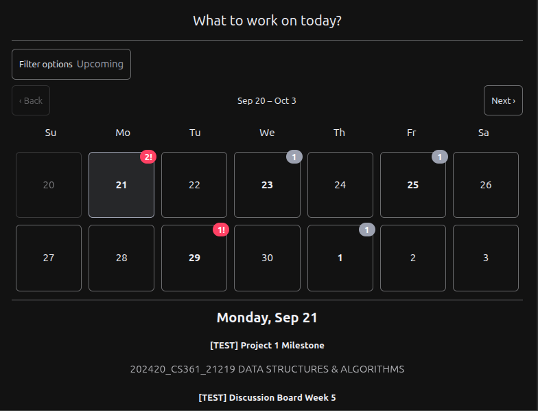
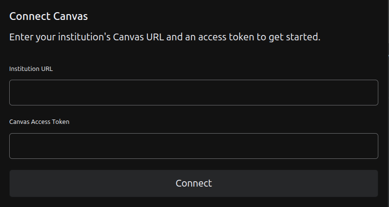
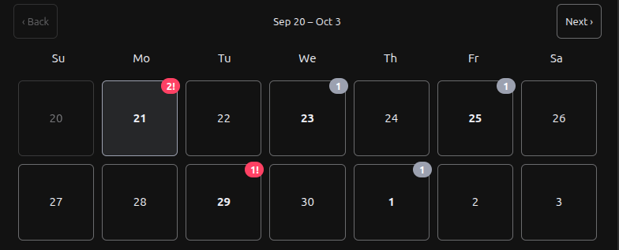
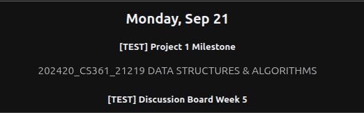
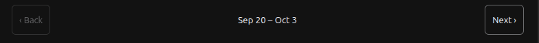
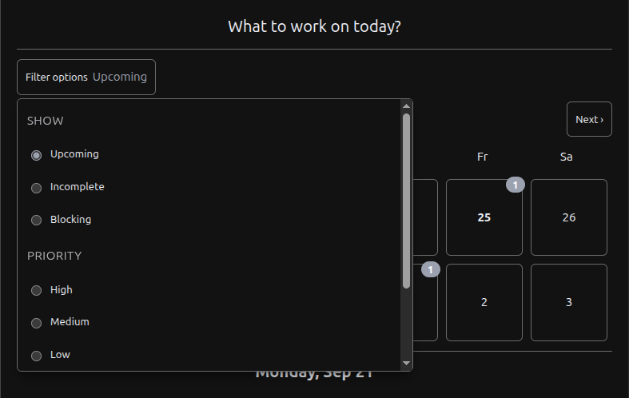
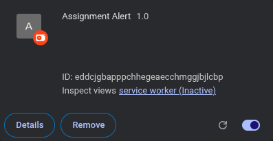
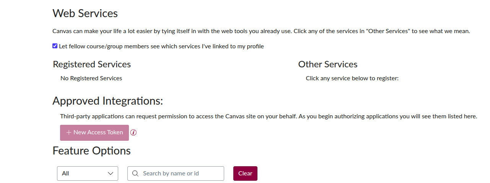

  # Assignment Alert

  Assignment Alert is a Chrome extension that pulls your Canvas assignments into one calendar in your browser. It runs against a Spring Boot server that you host yourself.

  <br>

  

  ---

  ## Why this exists

  On some assignments Canvas shows a "Available Until" date, that is the window where this assignment still accepts submissions.

  For me personally I would see that an assignment would be "Available Until" a certain date, and would think it was the due date and end up turning it in late or missing the submission window.

  ---
  

  ## Extension Features

  **Login screen.** Enter your school's Canvas URL, like `canvas.yourschool.edu`, plus an access token you generate in your Canvas profile (Step 8 in setup explains this in more detail).

  

  **Two-week calendar.** Each day shows how many assignments are due. Days with a high-priority assignment due get a red `!` tag.

  

  **Day details.** Click a day to see what is due. Click on the name of the assignment to go straight to the assignment on Canvas.

  

  **Week navigation.** Next and back buttons move through future weeks and return you to the current one.

  

  **Filters.** Show upcoming, incomplete, or blocking assignments. Filter by priority, High, Medium, Low or Done. Or show a single course.

  

  **Your own server.** Your Canvas data goes to a machine you run. It never comes to me.

  ---

  ## How it works 

  ```
  ┌──────────────────────┐   Bearer token    ┌────────────────────────┐   Canvas token   ┌──────────┐
  │  Chrome extension    │ ────────────────▶ │  Spring Boot backend   │ ───────────────▶ │  Canvas  │
  │  (React popup)       │ ◀──────────────── │  :8080                 │ ◀─────────────── │  LMS API │
  └──────────────────────┘   assignments     └───────────┬────────────┘   courses,       └──────────┘
                                                          │                assignments
                                            ┌─────────────┴─────────────┐
                                            │                           │
                                    ┌──────▼──────┐          ┌─────────▼──────────┐
                                    │ PostgreSQL  │          │ AWS Secrets Manager │
                                    │ courses,    │          │ your Canvas access  │
                                    │ assignments │          │ token               │
                                    └─────────────┘          └────────────────────┘
  ```

  Three steps:

  1. You enter your Canvas URL and an access token in the extension.
  2. The backend checks that token against the Canvas LMS API, stores it in AWS Secrets Manager, then uses that token to get your courses and assignments to copy into the database.
  3. The backend hands back a session token. The extension sends it to the backend on every request, and the server uses it to find out who it is talking to.

  Your Canvas token never gets stored in the db. Only the session token's hash does.

  ---

  ## Tech stack

  | Part | Technology |
  |---|---|
  | Extension | React 19, TypeScript, Vite 8, Chrome Manifest V3 (`@crxjs/vite-plugin`) |
  | Backend | Java 21, Spring Boot 4, Spring Security, Spring Data JPA / Hibernate |
  | Database | PostgreSQL 18 |
  | Secrets | AWS Secrets Manager |
  | Deployment | Docker and Docker Compose |

  ---

  ## Before you start

  You need:

  - **A Canvas account**. You get this from your Canvas profile.
  - **An AWS account.** Secrets Manager holds each user's Canvas token. It costs about $0.40 per secret per month, you can get around 100 dollars of free AWS credits when you make your account so look into that if you don't already have an account.
  - **Docker** with Docker Compose.
  - **Node.js 20.19+ or 22.12+** to build the extension.
  - **Google Chrome**, or any browser that allows Chrome extensions like Edge or Brave.
  - **Java 21** is optional. You only need it to run the backend outside Docker.

  ---

  ## Setup

  Note: Running the backend container for the first time will take a few minutes while dependencies download.

  ### 1. Clone it

  ```bash
  git clone https://github.com/gsing35/Assignment_Alert.git
  cd Assignment_Alert
  ```

  ### 2. Set up AWS access

  The backend needs permission to manage secrets named `User-*`. Create an IAM user, or an EC2 instance role if you are hosting on EC2, with this policy. Replace the region and account ID with yours:

  ```json
  {
    "Version": "2012-10-17",
    "Statement": [{
      "Effect": "Allow",
      "Action": [
        "secretsmanager:CreateSecret",
        "secretsmanager:GetSecretValue",
        "secretsmanager:PutSecretValue",
        "secretsmanager:DeleteSecret"
      ],
      "Resource": "arn:aws:secretsmanager:us-east-1:123456789012:secret:User-*"
    }]
  }
  ```

  The backend looks for credentials in the standard AWS order:

  - **On EC2:** attach the role to the instance. 
  - **Anywhere else:** put `AWS_ACCESS_KEY_ID` and `AWS_SECRET_ACCESS_KEY` in your `.env`, which is the next step.

  ### 3. Configure the backend

  ```bash
  cp .env.example .env
  ```

  Open `.env` and fill it in. The [configuration reference](#configuration-reference) below explains each value. Leave `APP_CORS_ALLOWED_ORIGINS` alone for now, you will set it in step 7.

  ### 4. Start the backend

  ```bash
  docker compose up -d --build
  ```

  This brings up PostgreSQL and the backend. The first build pulls dependencies and takes a few minutes. Check it:

  ```bash
  curl -i http://localhost:8080/api/v1/assignments
  ```

  A `401 Unauthorized` is the answer you want. It means the server is up and correctly turning away a request with no session token.

  ### 5. Build the extension

  Tell it where your backend lives:

  ```bash
  cd assignment-alert-ext
  echo "VITE_API_URL=http://localhost:8080" > .env
  ```

  Then open `assignment-alert-ext/manifest.json` and put your backend's address in `host_permissions`. Chrome blocks the extension from reaching any host that is not listed there:

  ```json
  "host_permissions": [
      "http://localhost:8080/*"
  ]
  ```

  Now build:

  ```bash
  npm install
  npm run build
  ```

  The built extension lands in `assignment-alert-ext/dist/`.

  ### 6. Load it into Chrome

  1. Go to `chrome://extensions`.
  2. Turn on Developer mode, top right.
  3. Click Load unpacked and pick the `assignment-alert-ext/dist` folder. Pick `dist`, not the project folder. This one trips people up.
  4. Copy the ID on the extension's card. It is a 32-letter string.
  5. If you ever need to reload the extension just hit the refresh arrow on the extension.

  

  ### 7. Connect the backend and frontend

  The backend only answers extensions you name. Put your ID in the root `.env`:

  ```bash
  APP_CORS_ALLOWED_ORIGINS=chrome-extension://your-extension-id-here
  ```

  Restart the backend so it picks up the change:

  ```bash
  docker compose up -d --force-recreate app
  ```

  ### 8. Connect Canvas

  1. In Canvas, go to Account -> Settings -> find Approved Integrations and click + New Access Token. Give it a purpose like "Assignment Alert" and copy the token. This is the only time you will be able to see the token.
  2. Click the Assignment Alert icon in your toolbar.
  3. Enter your Canvas URL, for example `canvas.yourschool.edu`, and paste the token.
  4. Click Connect. The first sync can take a minute.

  

  ---

  ## Configuration reference

  ### Backend: root `.env`

  | Variable | Example | Purpose |
  |---|---|---|
  | `DB_HOST` | `localhost` | Where the backend finds PostgreSQL |
  | `DB_PORT` | `5332` | PostgreSQL port on the host. Compose maps 5332 to 5432. |
  | `DB_NAME` | `assignment_alert` | Database name |
  | `POSTGRES_USER` | `postgres` | Database user |
  | `POSTGRES_PASSWORD` | `<make_a_password>` | Database password. |
  | `POSTGRES_DB` | `assignment_alert` | Database the Postgres container creates on first start |
  | `AWS_REGION` | `us-east-1` | Region where your secrets will be. It has to match the region in your IAM policy ARN. Do not change it after you have connected because your tokens only exist in that region. |
  | `APP_CORS_ALLOWED_ORIGINS` | `chrome-extension://abc…` | Which extension may call the API. This will be your extension id from step 6 earlier.|
  | `AWS_ACCESS_KEY_ID` / `AWS_SECRET_ACCESS_KEY` | | Only needed when you are not using an EC2 instance role |
  | `APP_CANVAS_ALLOWED_DOMAIN_SUFFIXES` | `instructure.com` | This is optional. It limits which Canvas hosts the server will contact. Comma-separated. Leaving it empty will allow any public host to connect. |
  | `APP_TOKEN_TTL_DAYS` | `30` | This is optional. Set it to how long you want your session token to be valid for.
  | `SERVER_FORWARD_HEADERS_STRATEGY` | `none` | This is optional. Set to `framework` only behind a reverse proxy you control. See the security notes for more info. |

  ### Extension: `assignment-alert-ext/.env`

  | Variable | Example | Purpose |
  |---|---|---|
  | `VITE_API_URL` | `http://localhost:8080` | Your backend's address, that will be compiled into the extension. Rebuild it after you change it. |

  ---

  ## Security

  Your Canvas token, like any token, is private info and should never be shared with anyone else or be made public. With it anyone can look at all of your data on Canvas which is why it is stored in Secrets Manager. 

  **Where data lives:**

  | Data | Location |
  |---|---|
  | Your Canvas access token | AWS Secrets Manager, as secret `User-{id}` |
  | Name, email, school URL, courses, assignments | PostgreSQL |
  | Session tokens | PostgreSQL, as SHA-256 hashes. Your raw Canvas Access Token is only ever stored in AWS Secrets Manager. |

  **How requests are protected:**

  - **Session tokens.** Every endpoint except connecting needs one. The server works out who you are from the token, so a request can only ever return your own data. These exist if you want to invite your friends to use your hosted instance and Secrets manager. The session token will only allow the each person to see their assignments.
  - **Stolen-database safety.** Tokens are stored hashed. Someone holding a copy of the database still cannot sign in as anyone.
  - **Reconnecting** Whenever you reconnect it will discard the old token and issue a new one.
  - **Token expiry.** By default a session token expires 30 days after it is issued. Change that to whatever you want in `APP_TOKEN_TTL_DAYS`.
  - **Canvas URL checks.** Since "Connecting" is the only endpoint that can't use the session token it instead checks to see if the URL it was handed is valid. It does this by checking if the URL uses 'https', it will also refuse any host that resolved to a private network. Your other containers, or the cloud metadata service. Tighten it further with `APP_CANVAS_ALLOWED_DOMAIN_SUFFIXES`.
  - **CORS.** Cross-origin resource sharing is what decides which sites a browser will let call your API. Only the extension IDs you put in `APP_CORS_ALLOWED_ORIGINS` get through.
  - **Rate limits:**

    | Endpoint | Limit |
    |---|---|
    | Connecting an account | 5 per hour per IP address |
    | Re-syncing a course | 10 per hour per user |
    | Everything else | 120 per minute per user |

  **Important notice if you deploy this:**

  - **Do not put port 8080 straight on the internet.** The traffic is not encrypted, so anyone on the network path can read session tokens. Keep the server on a private network, a VPN like [Tailscale](https://tailscale.com) works well and is what I used, it is free and easy to set up.
  - **Keep PostgreSQL private.** In `docker-compose.yml`, bind the database port to `127.0.0.1:5332:5432` instead of `5332:5432`. So only your machine can run it.
  - **On EC2, require IMDSv2**, version 2 of the instance metadata service. Set `HttpTokens: required` in the instance metadata options. It stops a server being tricked into reading its own AWS credentials.

  And delete your token in Canvas if you stop using the extension.

  Found a security problem? Please use GitHub's private vulnerability reporting instead of opening a public issue.

  ---

  ## API reference

  Every endpoint except `connect` needs an `Authorization: Bearer <session token>` header.

  | Method | Path | Description |
  |---|---|---|
  | `POST` | `/api/v1/canvas/connect` | Connect a Canvas account. Body: `{ "domain", "accessToken" }`. Returns the session token. |
  | `GET` | `/api/v1/assignments?filter=` | Your assignments. `filter` is `upcoming` (the default), `incomplete` or `blocking`. |
  | `GET` | `/api/v1/assignments?priority=` | Assignments by priority: `HIGH`, `MEDIUM`, `LOW` or `DONE` |
  | `GET` | `/api/v1/assignments?courseId=` | Assignments for one course, by Canvas course ID |
  | `GET` | `/api/v1/assignments/{id}` | A single assignment |
  | `PUT` | `/api/v1/assignments/{id}` | Update completed, priority, `blockedUntil` or `blockingEnabled` |
  | `PUT` | `/api/v1/assignments/{id}/completed?completed=` | Mark an assignment complete or incomplete |
  | `GET` | `/api/v1/courses/{courseId}` | A course and its assignments |
  | `PUT` | `/api/v1/courses/{courseId}` | Re-sync a course from Canvas |
  | `GET` | `/api/v1/users/me` | Your profile and courses |

  Pass more than one of `courseId`, `priority` and `filter` and only one wins. `courseId` first, then `priority`, then `filter`.

  **Errors you might see:**

  | Status | Means |
  |---|---|
  | `400` | Bad request. Usually a Canvas URL that failed validation. |
  | `401` | No session token, an expired one, or a Canvas token Canvas rejected. |
  | `404` | That assignment, course or user is not yours, or does not exist. |
  | `409` | Duplicate course or assignment. |
  | `429` | You hit a rate limit. Check the `Retry-After` header. |
  | `502` | Canvas itself failed or timed out. |

  ---

  ## Project structure

  ```
  Assignment_Alert/
  ├── src/main/java/…/Assignment_Alert/
  │   ├── assignments/        Assignment entity, repository, service, controller
  │   ├── courses/            Course entity, repository, service, controller
  │   ├── user/               User entity, repository, service, controller
  │   ├── canvas/             Canvas API client, domain validation, connection, sync
  │   ├── security/           Token auth, rate limiting, CORS, security config
  │   ├── aws/                Secrets Manager client
  │   ├── exceptions/         Error handling
  │   └── config/             Shared beans
  ├── src/main/resources/
  │   └── application.yaml    Backend configuration
  ├── assignment-alert-ext/   The Chrome extension
  │   ├── manifest.json       Extension manifest, host permissions live here
  │   └── src/
  │       ├── api/            One file per backend resource
  │       ├── components/     Calendar, login screen, filters, spinner
  │       ├── lib/            Session storage, filter logic
  │       └── types/          TypeScript copies of the backend's response shapes
  ├── docker-compose.yml
  ├── dockerfile
  └── .env.example
  ```

  ---

  ## Troubleshooting

  | What you see | What is probably wrong |
  |---|---|
  | Everything fails right after connecting | `APP_CORS_ALLOWED_ORIGINS` does not match your extension ID, or you did not restart the backend after changing it |
  | *"Can't reach the server"* | Wrong `VITE_API_URL`, the backend is down, or the address is missing from `host_permissions` in `manifest.json` |
  | *"That doesn't look like a valid Canvas address"* | The URL has to be `https` and has to be a public host. A private IP or an `http://` address gets refused on purpose. |
  | The popup keeps dropping back to the login screen | Your session token was rejected. It may have expired after 30 days, or you reconnected from another browser. Connect again. |
  | *"Too many requests. Try again in N minutes."* | A rate limit. Wait it out, or restart the backend to clear the counters. |
  | The calendar says "Nothing due." everywhere | It only shows assignments due from today on. If your courses have ended, there is nothing upcoming. |
  | Changes to the extension do not show up | Run `npm run build`, then reload the extension. Chrome loads from `dist/`, not `src/`. |
  | Colors do not change when you edit `index.css` | You are probably in dark mode. Those colors are in their own block further down the file. |

  ---

  ## License

  [MIT](LICENSE), © 2026 gsing35.


